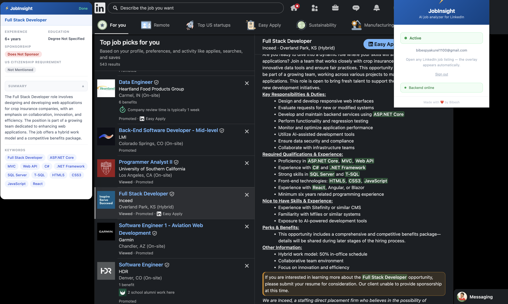

# JobInsight — LinkedIn Job Analyzer

A Chrome extension that automatically analyzes LinkedIn job postings and shows a floating overlay with key details extracted by AI.

## Preview

<p align="center">
    
</p>

## What it shows

- **Experience** — years required
- **Education** — degree level and whether required or preferred
- **Sponsorship** — Sponsors / Does Not Sponsor / Not Mentioned
- **US Citizenship** — flags if citizenship or security clearance is required
- **Summary** — 2-3 sentence overview of the role
- **Keywords** — job-specific technical terms, highlighted in the job description

## Installation

1. Go to `chrome://extensions` in Chrome
2. Enable **Developer Mode** (top-right toggle)
3. Click **Load unpacked** and select this folder

## Setup

1. Click the **JobInsight** icon in the Chrome toolbar
2. Sign in with your **Google account**
3. Make sure the **JobInsight backend** is deployed and reachable
4. Open any LinkedIn job listing

## Usage

Open any LinkedIn job listing — the overlay appears automatically in the top-right corner. Drag it to reposition, or resize it from any edge.

Results are cached for 7 days so re-opening the same job is instant.

## Configuration

This extension uses a backend proxy for OpenAI requests.

- Users sign in with Google before using the extension.
- The Chrome extension sends job description text to the backend.
- The backend holds the OpenAI API key securely and calls OpenAI.
- The API key is never stored in the extension source code.

## Backend

The production extension is configured to call the deployed API at `https://jobinsight-6nyq.onrender.com`.

For local backend development:

1. Go to `backend/`
2. Run `npm install`
3. Create `.env` from `.env.example`
4. Add your `OPENAI_API_KEY`
5. Run `npm run dev`

## File structure

```
JobInsight/
├── manifest.json               # Chrome MV3 config
├── backend/                    # Backend proxy for OpenAI
├── background/
│   └── service-worker.js       # Extension -> backend API calls
├── content/
│   ├── linkedin-scraper.js     # Page scraping + overlay logic
│   └── overlay.css             # Overlay styles
├── icons/                      # Extension icons
└── popup/
    ├── popup.html              # Sign-in UI
    └── popup.js                # Google OAuth & user management
```

## Cost

Uses GPT-4o-mini. Each job analysis costs roughly **$0.0003–0.0005** — less than a tenth of a cent.
