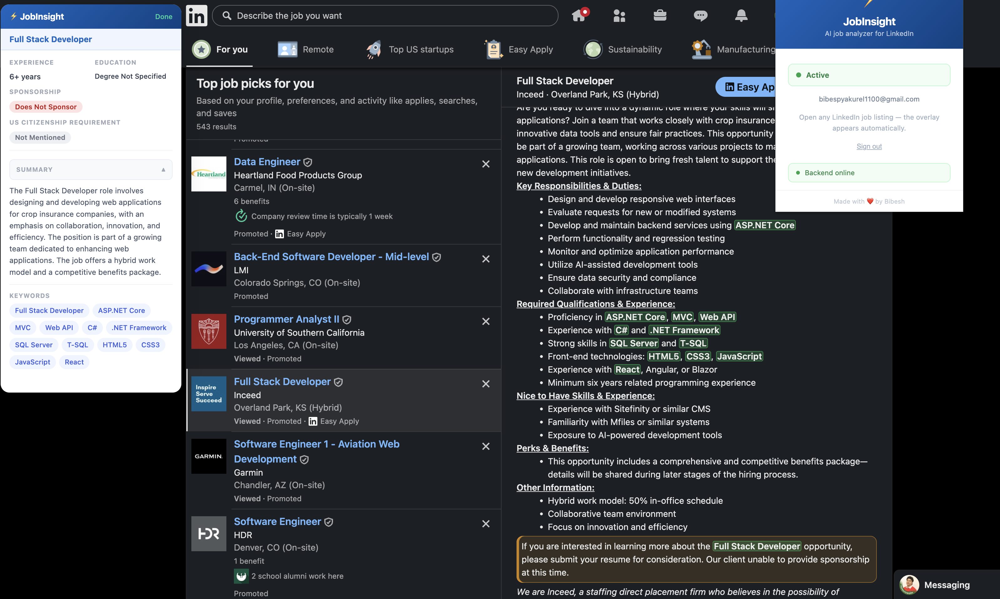

# JobInsight

A Chrome extension that reads the LinkedIn job posting you're looking at and answers the
questions a job seeker actually screens on — does it sponsor, does it require citizenship,
how many years of experience — in a draggable overlay, without leaving the page.

[](https://github.com/bibeshpyakurel/JobInsight/actions/workflows/ci.yml)
[](LICENSE)
[](https://github.com/bibeshpyakurel/JobInsight)

JobInsight is a browser extension, not a hosted site, so there is no live demo link —
it runs inside LinkedIn. [Load it in about a minute](#install) and it works on any
LinkedIn job listing.

## Screenshots



> Two more shots would round this out. Drop each file at the path shown and uncomment
> the matching line.

| Screenshot | Path | Why it matters |
|---|---|---|
| The overlay close-up on a single job, with the sponsorship and citizenship rows visible | `screenshots/overlay-detail.png` | The product in one frame — the fields people install this for |
| The popup showing the Google sign-in state | `screenshots/popup-signin.png` | Shows the auth gate that sits in front of the backend proxy |

<!--  -->
<!--  -->

## What it shows

For each job posting, the overlay extracts:

- **Experience** — years required
- **Education** — degree level, and whether required or preferred
- **Sponsorship** — Sponsors / Does Not Sponsor / Not Mentioned
- **US Citizenship** — flags if citizenship or security clearance is required
- **Summary** — a 2–3 sentence overview of the role
- **Keywords** — job-specific technical terms, highlighted in the job description

## What it demonstrates technically

- **The API key never ships to the client.** The extension holds no OpenAI credential;
  it posts job text to a Node/Express proxy that holds the key server-side. The proxy
  gates `/api/analyze` on the configured extension origin, and CI tests that gate
  specifically — it is the security boundary the whole design rests on.
- **A complete Chrome MV3 architecture**: a content script that scrapes and renders the
  overlay into LinkedIn's DOM, a service worker that brokers the backend calls, and a
  popup that owns Google OAuth via `chrome.identity`.
- **A 7-day client-side cache** (`JOB_CACHE_TTL` in `content/linkedin-scraper.js`) keyed
  per job, so revisiting a posting is instant and costs nothing — the cheapest possible
  fix for redundant LLM calls.
- **Structured extraction, not free text.** GPT-4o-mini is prompted to return six fixed
  fields the UI can render directly, rather than prose the extension would have to parse.
- **CI catches the failure mode that is invisible until reinstall** — it validates
  `manifest.json`, checks every script the manifest names actually exists, syntax-checks
  every extension script, and audits production dependencies.

## Stack

| Layer | Technology |
|---|---|
| Extension | Chrome MV3, vanilla JavaScript (content script, service worker, popup) |
| Backend proxy | Node.js, Express 4 |
| Auth | Google OAuth 2.0 via `chrome.identity` |
| AI | OpenAI GPT-4o-mini |
| Hosting | Render (backend proxy) |
| CI | GitHub Actions (Node 20 and 22) |

## Install

The extension is not on the Chrome Web Store — load it unpacked:

1. Clone this repository.
2. Open `chrome://extensions` in Chrome.
3. Enable **Developer mode** (top-right toggle).
4. Click **Load unpacked** and select the repository root (the folder containing
   `manifest.json`).
5. Click the **JobInsight** icon in the toolbar and sign in with Google.
6. Open any LinkedIn job listing — the overlay appears in the top-right corner. Drag it
   to reposition, or resize it from any edge.

The packaged extension points at the deployed proxy at
`https://jobinsight-6nyq.onrender.com`, so it works out of the box after sign-in.

## Quick start (backend proxy)

Only needed if you want to run the proxy yourself. Commands are the scripts in
`backend/package.json`.

```bash
cd backend
npm install
cp .env.example .env     # then set OPENAI_API_KEY
npm run dev              # node --watch server.js
npm test                 # node --test
```

The proxy exposes `POST /api/analyze` and `GET /api/health`.

## Cost

Uses GPT-4o-mini. Each job analysis costs roughly **$0.0003–0.0005** — less than a tenth
of a cent.

## Project structure

```
JobInsight/
├── manifest.json               # Chrome MV3 config
├── backend/                    # Express proxy that holds the OpenAI key
│   └── server.js               # POST /api/analyze, GET /api/health
├── background/
│   └── service-worker.js       # Extension -> backend API calls
├── content/
│   ├── linkedin-scraper.js     # Page scraping, overlay, 7-day cache
│   └── overlay.css             # Overlay styles
├── popup/
│   ├── popup.html              # Sign-in UI
│   └── popup.js                # Google OAuth & user management
├── icons/
└── screenshots/
```

## Status

Working and in personal use. The proxy is deployed on Render and CI runs on every push
to `main`. Built as a portfolio project; not published to the Chrome Web Store.

## License

MIT — see [LICENSE](LICENSE).
